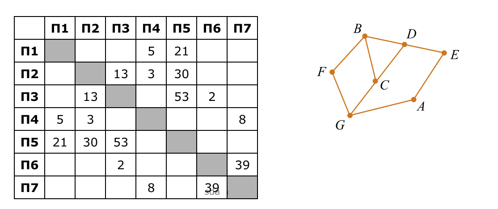
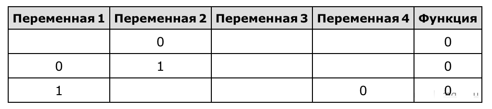
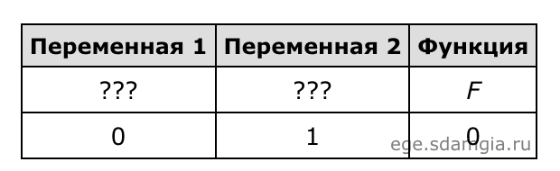
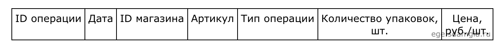
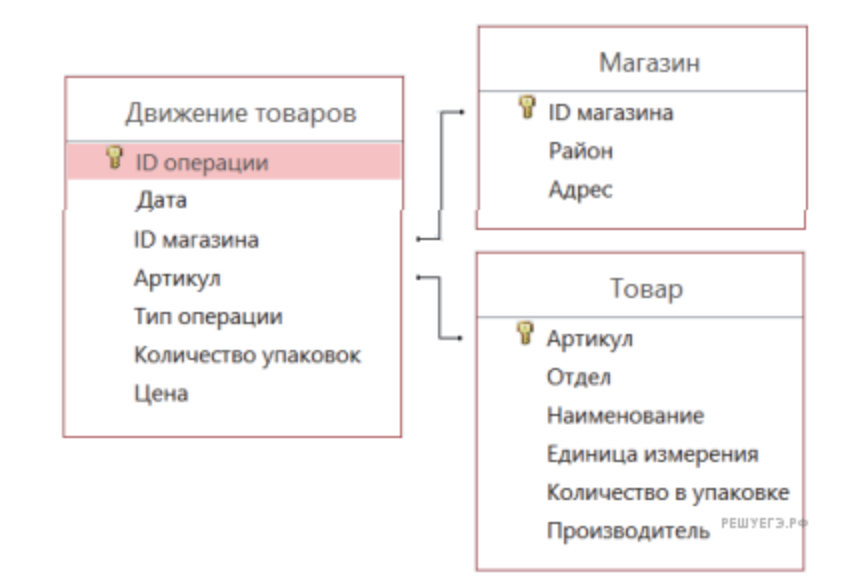
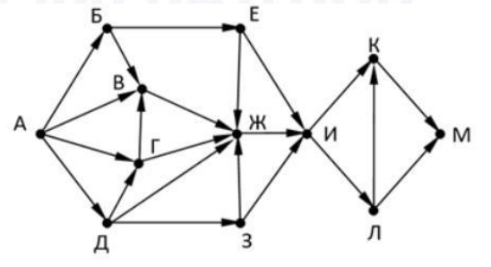

# ЕГЭ по информатике 2023
## Прочитать перед началом:
Указания: задания
- 3
- 9
- 10
- 17
- 18
- 22
- 24
- 26
- 27

выполняются с использованием файлов.

Файлы, необходимые для решения заданий находятся в папке `./files`. Для каждого задания файл представлен в единственном экземпляре (для задания 27 файлов — 2) и имеет имя, соответствующее номеру задания.
## Вариант 1
### 1
На рисунке схема дорог Н-ского района изображена в виде графа, в таблице содержатся сведения о протяжённости каждой из этих дорог (в километрах).

Так как таблицу и схему рисовали **независимо** друг от друга, то нумерация населённых пунктов в таблице никак **не связана** с буквенными обозначениями на графе. Определите, какова сумма протяжённостей дорог из пункта D в пункт B и из пункта A в пункт E.
В ответе запишите **целое** число.
### 2
Миша заполнял таблицу истинности логической функции F

¬ (y → x) ∨ (z → w) ∨ ¬z,

но успел заполнить лишь фрагмент из трёх различных её строк, даже не указав, какому столбцу таблицы соответствует каждая из переменных w, x, y, z.

Определите, какому столбцу таблицы соответствует каждая из переменных w, x, y, z.

В ответе напишите буквы w, x, y, z в том порядке, в котором идут соответствующие им столбцы (сначала буква, соответствующая первому столбцу; затем буква, соответствующая второму столбцу, и т. д.). Буквы в ответе пишите **подряд**, никаких разделителей между буквами ставить не нужно.

Пример. Функция F задана выражением ¬ x ∨ y, зависящим от двух переменных, а фрагмент таблицы имеет следующий вид

В этом случае первому столбцу соответствует переменная y, а второму столбцу  — переменная x. В ответе следует написать: yx.

### 3
В файле приведён фрагмент базы данных «Продукты» о поставках товаров в магазины районов города. База данных состоит из трёх таблиц.

Таблица «Движение товаров» содержит записи о поставках товаров в магазины в течение первой декады июня 2021 г., а также информацию о проданных товарах. Поле Тип операции содержит значение Поступление или Продажа, а в соответствующее поле Количество упаковок, шт. занесена информация о том, сколько упаковок товара поступило в магазин или было продано в течение дня. Заголовок таблицы имеет следующий вид.

Таблица «Товар» содержит информацию об основных характеристиках каждого товара. Заголовок таблицы имеет следующий вид.

Таблица «Магазин» содержит информацию о местонахождении магазинов. Заголовок таблицы имеет следующий вид.

На рисунке приведена схема указанной базы данных.

Используя информацию из приведённой базы данных, определите, **сколько килограмм макарон спагетти поступило в магазины Первомайского района за период с 1 по 10 июня включительно.**

В ответе запишите только **число**.

### 4
По каналу связи передаются сообщения, содержащие только шесть букв: А, Б, В, Е, С, Т. Для передачи используется двоичный код, удовлетворяющий условию Фано. Кодовые слова для некоторых букв известны: Б  — 100, С  — 101. Какое **наименьшее** количество двоичных знаков потребуется для кодирования слова АТТЕСТАТ?

Примечание. Условие Фано означает, что ни одно кодовое слово не является началом другого кодового слова.

### 5

Алгоритм получает на вход натуральное число N > 1 и строит по нему новое число R следующим образом:

1. Строится двоичная запись числа N.
2. В конец записи (справа) дописывается вторая справа цифра двоичной записи.
3. В конец записи (справа) дописывается вторая слева цифра двоичной записи.
4. Результат переводится в десятичную систему.

Пример. Дано число N  =  13. Алгоритм работает следующим образом:

1. Двоичная запись числа N: 1101.
2. Вторая справа цифра 0, новая запись 11010.
3. Вторая слева цифра 1, новая запись 110101.
4. Результат работы алгоритма R  =  53.

При каком **наименьшем** числе N в результате работы алгоритма получится R > 180? В ответе запишите это число в **десятичной** системе счисления.

### 6

Исполнитель Черепаха действует на плоскости с декартовой системой координат. В начальный момент Черепаха находится в начале координат, её голова направлена вдоль положительного направления оси ординат, хвост опущен. При опущенном хвосте Черепаха оставляет на поле след в виде линии. В каждый конкретный момент известно положение исполнителя и направление его движения. У исполнителя существует две команды: Вперёд n (где n  — целое число), вызывающая передвижение Черепахи на n единиц в том направлении, куда указывает её голова, и Направо m (где m  — целое число), вызывающая изменение направления движения на m градусов по часовой стрелке.

Запись

    Повтори k [Команда1 Команда2 … КомандаS]

означает, что последовательность из S команд повторится k раз.

Черепахе был дан для исполнения следующий алгоритм:

    Повтори 4 [Вперёд 12 Направо 90]

    Повтори 3 [Вперёд 12 Направо 120]

Определите, сколько точек с **целочисленными** координатами будут находиться **внутри** области, ограниченной линией, заданной данным алгоритмом: 

    Повтори 4 [Вперёд 12 Направо 90]

и находиться **вне** области, ограниченной линией, заданной данным алгоритмом:
    
    Повтори 3 [Вперёд 12 Направо 120]
    
**Точки на линии учитывать не следует.**

### 7

Музыкальный фрагмент был оцифрован и записан в виде файла без использования сжатия данных. Получившийся файл был передан в город А по каналу связи за 30 секунд. Затем тот же музыкальный фрагмент был оцифрован повторно с разрешением в 2 раза выше и частотой дискретизации в 1,5 раза меньше, чем в первый раз. Сжатие данных не производилось. Полученный файл был передан в город Б; пропускная способность канала связи с городом Б в 4 раза выше, чем канала связи с городом А.

Сколько **секунд** длилась передача файла в город Б? В ответе запишите только **целое** число, единицу измерения писать не нужно.

### 8

Шифр кодового замка представляет собой последовательность из пяти символов, каждый из которых является цифрой от 1 до 5.

Сколько различных вариантов шифра можно задать, если известно, что цифра 1 встречается ровно **три** раза, а каждая из других допустимых цифр может встречаться в шифре **любое** количество раз или не встречаться **совсем**?

### 9

Откройте файл электронной таблицы, содержащей в каждой строке пять натуральных чисел.
Определите количество строк таблицы, содержащих числа, для которых выполнены все условия:

— в строке только одно число отличается от остальных;

— остальные 4 числа четные;

— остальные 4 числа не больше оставшегося;

В ответе запишите **только** число.

### 10

Определите, сколько раз **в сносках** приложенного издания произведения А. С. Пушкина «Капитанская дочка» встречается слово «царский» в любой форме.

### 11

Каждый объект, зарегистрированный в информационной системе, получает уникальный код из трёх частей. Первая часть кода определяет категорию объекта. Всего выделяется 7 категорий, которые обозначаются латинскими буквами A, B, C, D, E, F, G. Вторая часть кода описывает группу, к которой принадлежит объект. Эта часть состоит из 10 символов, каждый из которых может быть любой из 19 заглавных латинских букв (буквы, задающие категории, не используются). Третья часть кода задаёт порядковый номер объекта внутри категории и может быть целым числом от 1 до 2999. Каждая из трёх частей кодируется независимо. Для представления категории и группы используют посимвольное кодирование, все символы в пределах каждой части кода кодируют одинаковым минимально возможным количеством битов. Порядковый номер кодируется как двоичное целое число с использованием минимально возможного количества битов. Для кода в целом выделяется минимально возможное целое количество байтов. Кроме того, для каждого объекта выделен одинаковый объём памяти для хранения дополнительных регистрационных данных.

Для хранения кода и дополнительных регистрационных данных 34 объектов потребовалось 918 байт.

**Сколько** байтов выделено для хранения **дополнительных** регистрационных данных **одного** объекта? В ответе запишите только **целое** число  — количество **байтов**.

### 12

Исполнитель Редактор получает на вход строку цифр и преобразовывает её. Редактор может выполнять две команды, в обеих командах v и w обозначают цепочки цифр.

    А)  заменить (v, w).

Эта команда заменяет в строке первое слева вхождение цепочки v на цепочку w. Например, выполнение команды

    заменить (111, 27)

преобразует строку 05111150 в строку 0527150.

Если в строке нет вхождений цепочки v, то выполнение команды заменить (v, w) не меняет эту строку.

    Б)  нашлось (v).

Эта команда проверяет, встречается ли цепочка v в строке исполнителя Редактор. Если она встречается, то команда возвращает логическое значение «истина», в противном случае возвращает значение «ложь». Строка исполнителя при этом не изменяется.

    Цикл
        ПОКА условие
            последовательность команд
        КОНЕЦ ПОКА

выполняется, пока условие истинно.

В конструкции

    ЕСЛИ условие
        ТО команда1
    ИНАЧЕ команда2
    КОНЕЦ ЕСЛИ

выполняется команда1 (если условие истинно) или команда2 (если условие ложно).

 

Дана программа для Редактора:

    НАЧАЛО
        ПОКА нашлось (>1) ИЛИ нашлось (>2) ИЛИ нашлось (>0)
            ЕСЛИ нашлось (>1)
                ТО заменить (>1, 22>)
            КОНЕЦ ЕСЛИ
            ЕСЛИ нашлось (>2)
                ТО заменить (>2, 2>)
            КОНЕЦ ЕСЛИ
            ЕСЛИ нашлось (>0)
                ТО заменить (>0, 1>)
            КОНЕЦ ЕСЛИ
        КОНЕЦ ПОКА
    КОНЕЦ

 

На вход приведённой выше программе поступает строка, начинающаяся с символа «>», а затем содержащая 39 цифр «0», n цифр «1» и 39 цифр «2», расположенных в произвольном порядке.

Определите **наименьшее** значение n, при котором сумма числовых значений цифр строки, получившейся в результате выполнения программы, является **простым** числом.

### 13
На рисунке представлена схема дорог, связывающих города А, Б, В, Г, Д, Е,
Ж, З, И, К, Л, М. По каждой дороге можно двигаться только в одном
направлении, указанном стрелкой. Какова **длина** самого **длинного** пути из
города А в город М. Длиной пути считать количество дорог, составляющих
этот путь.

### 14

Операнды арифметического выражения записаны в системах счисления с основаниями 9 и 12:

$$
2y66x_9 + x0y1_{12}
$$

В записи чисел переменными $x$ и $y$ обозначены допустимые в данных системах счисления **неизвестные** цифры. Определите значения x и y, при которых значение данного арифметического выражения будет **наименьшим и кратно 170**. Для найденных значений x и y **вычислите частное** от деления значения арифметического выражения на 170 и укажите его в ответе в десятичной системе счисления. Основание системы счисления в ответе указывать не нужно.

### 15
Обозначим через $ДЕЛ(n, m)$ утверждение «натуральное число n делится без остатка на натуральное число m».

Для какого **наибольшего** натурального числа А формула

$$
ДЕЛ(90, A) ∧ (¬ДЕЛ(x, А) → (ДЕЛ(x, 15) → ¬ДЕЛ(x, 20)))
$$

тождественно истинна (то есть принимает значение 1 при любом натуральном значении переменной x)?

### 16

Алгоритм вычисления значения функции F(n), где n  — целое неотрицательное число, задан следующими соотношениями:

F(0) = 0;

F(n) = F(n / 2), если n > 0 и при этом чётно;

F(n) = 1 + F(n − 1), если n нечётно.

**Сколько** существует таких чисел n, что 1 ≤ n ≤ 1000 и F(n)  =  3?

### 17

В файле содержится последовательность из 10 000 целых положительных чисел. Каждое число не превышает 10 000. Определите и запишите в ответе сначала **количество** пар элементов последовательности, у которых **сумма элементов кратна 10**, затем **максимальную** из сумм элементов таких пар. В данной задаче под парой подразумевается два различных элемента последовательности. Порядок элементов в паре не важен.

### 18

Квадрат разлинован на N×N клеток (1 < N < 17). Исполнитель Робот может перемещаться по клеткам, выполняя за одно перемещение одну из двух команд: вправо или вниз. По команде вправо Робот перемещается в соседнюю правую клетку, по команде вниз  — в соседнюю нижнюю. При попытке выхода за границу квадрата Робот разрушается. Перед каждым запуском Робота в каждой клетке квадрата лежит монета достоинством от 1 до 100. Посетив клетку, Робот забирает монету с собой; это также относится к начальной и конечной клетке маршрута Робота.

Откройте файл. **Определите максимальную и минимальную денежную сумму**, которую может собрать Робот, пройдя из левой верхней клетки в правую нижнюю. В ответ запишите два числа друг за другом без разделительных знаков  — **сначала** **максимальную** сумму, **затем** **минимальную**.

Исходные данные представляют собой электронную таблицу размером N×N, каждая ячейка которой соответствует клетке квадрата.

Пример входных данных:

Для указанных входных данных ответом должна быть пара чисел 41 и 22.

### 19

Два игрока, Петя и Ваня, играют в следующую игру. Перед игроками лежит куча камней. Игроки ходят по очереди, первый ход делает Петя. За один ход игрок может добавить в кучу один или два камня или увеличить количество камней в куче в два раза. Например, имея кучу из 15 камней, за один ход можно получить кучу из 16, 17 или 30 камней. У каждого игрока, чтобы делать ходы, есть неограниченное количество камней.

Игра завершается в тот момент, когда количество камней в куче становится не менее 56. Победителем считается игрок, сделавший последний ход, то есть первым получивший кучу, в которой будет 56 или больше камней.

В начальный момент в куче было S камней, 1 ≤ S ≤ 55.

Будем говорить, что игрок имеет выигрышную стратегию, если он может выиграть при любых ходах противника. Описать стратегию игрока  — значит, описать, какой ход он должен сделать в любой ситуации, которая ему может встретиться при различной игре противника.

Известно, что Ваня выиграл своим первым ходом после неудачного первого хода Пети. Укажите **минимальное** значение S, когда такая ситуация возможна.

### 20

Для игры описанной в задании 19 **найдите два** таких значения S, при которых у Пети есть выигрышная стратегия, причём одновременно выполняются два условия:

— Петя не может выиграть за один ход;

— Петя может выиграть своим вторым ходом независимо от того, как будет ходить Ваня.

Найденные значения запишите в ответе в порядке возрастания без разделительных знаков.

### 21

Для игры описанной в задании 19 **найдите минимальное значение S**, при котором одновременно выполняются два условия:

— у Вани есть выигрышная стратегия, позволяющая ему выиграть первым или вторым ходом при любой игре Пети;

— у Вани нет стратегии, которая позволит ему гарантированно выиграть первым ходом.

### 22

В файле 22.xlsx содержится информация о совокупности N вычислительных процессов, которые могут выполняться параллельно или последовательно. Будем говорить, что процесс B зависит от процесса A, если для выполнения процесса B необходимы результаты выполнения процесса A. В этом случае процессы могут выполняться только последовательно.

Информация о процессах представлена в файле в виде таблицы. В первой строке таблицы указан идентификатор процесса (ID), во второй строке таблицы  — время его выполнения в миллисекундах, в третьей строке перечислены с разделителем «;» ID процессов, от которых зависит данный процесс. Если процесс является независимым, то в таблице указано значение 0.

Определите **минимальное** время, через которое завершится выполнение **всей** совокупности процессов, при условии, что все независимые друг от друга процессы **могут** выполняться параллельно.

Типовой пример организации данных в файле:

В данном случае независимые процессы 1 и 2 могут выполняться параллельно, при этом процесс 1 завершится через 4 мс, а процесс 2  — через 3 мс с момента старта. Процесс 3 может начаться только после завершения обоих процессов 1 и 2, то есть, через 4 мс после старта. Он длится 1 мс и закончится через 4 + 1 = 5 мс после старта. Выполнение процесса 4 может начаться только после завершения процесса 3, то есть, через 5 мс. Он длится 7 мс, так что минимальное время завершения всех процессов равно 5 + 7 = 12 мс.

### 23

Исполнитель НечетМ преобразует число на экране. У исполнителя НечетМ две команды, которым присвоены номера:

1. прибавь 1

2. сделай нечётное

Первая из этих команд увеличивает число x на экране на 1, вторая переводит число x в число 2x+1. Например, вторая команда переводит число 10 в число 21. Программа для исполнителя НечетМ – это последовательность команд. **Сколько** существует таких программ, которые число 1 преобразуют в число 27, причём траектория вычислений **не содержит** число 26?

Траектория вычислений программы – это последовательность результатов выполнения всех команд программы. Например, для программы 121 при исходном числе 7 траектория будет состоять из чисел 8, 17, 18.

### 24
 Текстовый файл содержит **только** заглавные буквы латинского алфавита (ABC...Z). **Определите максимальное количество идущих подряд символов, среди которых нет ни одной буквы E и при этом не менее трёх букв A.**

Для выполнения этого задания следует написать программу.

### 25

Назовём маской числа последовательность цифр, в которой также могут встречаться следующие символы:

— символ «?» означает ровно одну произвольную цифру;

— символ «\*» означает любую последовательность цифр произвольной длины; в том числе «\*» может задавать и пустую последовательность.

Например, маске 123*4?5 соответствуют числа 123405 и 12300405.

Среди натуральных чисел, не превышающих 109, **найдите все числа, соответствующие маске** 12345?7?8, **делящиеся** на число 23 без остатка.

В ответе запишите в первом столбце таблицы все найденные числа в порядке возрастания, а во **втором** столбце  — соответствующие им результаты деления этих чисел на 23.

### 26
В текстовом файле записан набор натуральных чисел, не превышающих 109. **Гарантируется**, что все числа **различны**. Необходимо определить, **сколько** в наборе таких пар чисел, что числа в паре и**меют одинаковую чётность**, а их сумма тоже присутствует в файле, и чему равна наибольшая из сумм таких пар.

Входные данные.

Первая строка входного файла содержит целое число N  — общее количество чисел в наборе. Каждая из следующих N строк содержит одно число.

В ответе запишите два целых числа: сначала количество пар, затем наибольшую сумму.

Пример входного файла:

6

3

8

14

11

22

17

В данном случае есть две подходящие пары: 3 и 11 (сумма 14), 8 и 14 (сумма 22). В ответе надо записать числа 2 и 22.

### 27

Имеется набор данных, состоящий из пар положительных целых чисел. Необходимо выбрать из каждой пары ровно одно число так, чтобы сумма всех выбранных чисел не делилась на 3 и при этом была максимально возможной. Гарантируется, что искомую сумму получить можно. **Программа должна напечатать одно число  — максимально возможную сумму, соответствующую условиям задачи.**

Входные данные.

Даны два входных файла (файл A и файл B), каждый из которых содержит в первой строке количество пар N (1 ≤ N ≤ 100000). Каждая из следующих N строк содержит два натуральных числа, не превышающих 10 000.

Пример организации исходных данных во входном файле:

6

1 3

5 12

6 9

5 4

3 3

1 1

Для указанных входных данных значением искомой суммы должно быть число 32.

В ответе укажите два числа: сначала значение искомой суммы для файла А, затем для файла B.

**Предупреждение**: для обработки файла B не следует использовать переборный алгоритм, вычисляющий сумму для всех возможных вариантов, поскольку написанная по такому алгоритму программа будет выполняться слишком долго.

## Источники
1. inf-ege.sdamgia.ru — РЕШУ ЕГЭ раздел информатика
2. vpr-ege.ru
3. http://ege.fipi.ru/ — открытый банк заданий егэ
4. кое что свое

Все права на материалы выше принадлежат их непосредственным владельцам.